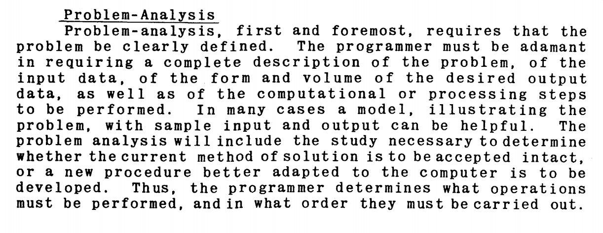
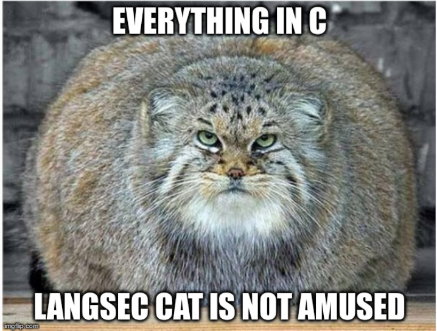
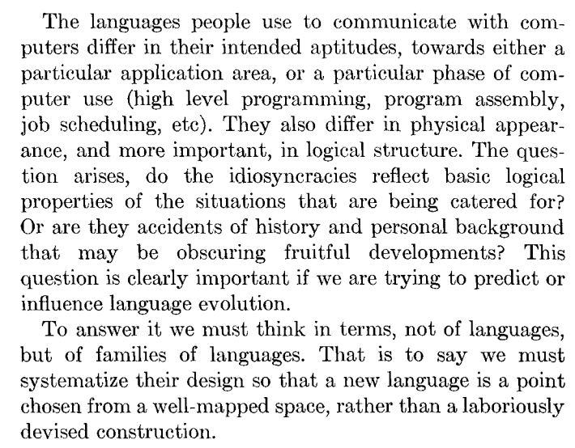

# the multician of venice
### a history of software composition & security

---

# overview

1. intro
2. why
3. take aways
4. software composition
5. notables
6. Hopper
7. Landin
8. Liskov
9. Multicians
10. the shape of the next 700 security tools to come

<!--

footer: The Multician of Venice :: Midsummer 2020 :: lojikil
page_number: true

-->

---

# `$ finger lojikil`

```
[lojikil.com]
Stefan Edwards (lojikil) is not presently logged in.

- Practice Lead at Trail of Bits
- Twitter/Github/Lobste.rs: lojikil
- Works in: Defense, FinTech, Blockchain, IoT, compilers,
vCISO services, threat modeling
- Previous: net, web, adversary sim, &c. 
- Infosec philosopher, programming 
language theorist, everyday agronomer, father.
- As heard on Absolute AppSec (multiple) and Risky
Business (No. 559).

WARNING: DEAF
WARNING: Noo Yawk
```

---

# why


... and then we accidentally made a con

---

# why

- but really...
- lots of historical research into languages
- highlight some of my favorites

---

# take aways

<!--

as per always...

-->

1. we have been studying how to compose software since at least 1951
2. many techniques are still applicable today
3. lesser-known areas of software engineering/computer science

---

# software composition

- :hot_pepper: Algorithms + Data Structures = Programs (by Wirth, 1976)
- slightly less :hot_pepper:: 
    - function composition
    - object/data structure composition
    - visibility

---

# software composition

<!--

compare this...

-->

```scheme
; Oleg Kiselyov's Scheme Object System
(define (make-point-2D x y)
  (define (get-x) x)
  (define (get-y) y)
  (define (set-x! new-x) (set! x new-x))
  (define (set-y! new-y) (set! y new-y))
  (lambda (selector . args)     ; a dispatcher
      (case selector
        ((get-x) (apply get-x args))
        ((get-y) (apply get-y args))
        ((set-x!) (apply set-x! args))
        ((set-y!) (apply set-y! args))
        (else (error "don't understand " selector)))))

```

---

# software composition

<!--

with this

-->

```ocaml
  class point_2d ~x ~y = object
      method x : float = x
      method y : float = y
    end;;
```

---

# software composition

- both achieve the same thing:
    - data structure with two members, `x` and `y`
    - visibility/scope
- very different style:
    - Scheme: a closure with dispatch, uses symbols, enclosed/captured variables, can't capture missed access at compile time easily
    - OCaml: slightly odd syntax, but readily understandable

---

# software composition

```scheme
; Scheme:

(define foo (make-point-2d 3.0 4.0))
(display (foo 'get-x))
(newline)
(display (foo 'get-y))
(newline)
```

vs

```ocaml
(* OCaml: *)

let f = new point_2d 3.0 4.0;;
print_float f#x;;
print_float f#y;;

```

---

# software composition

<!--

what we can do in a language shapes
how we use it

which in turn influences what we can
easily do to understand it

-->

- language shapes software
- influences:
    - specification
    - testing
    - tooling (compilers => linters => program analysis)
- :hot_pepper: most security falls under the above

---

# software composition



_source: UNIVAC Programming, 1953_

---

# software composition

- obviously, very langsec focused



---

# notables

<!--

there are a number of notable people
who did not make the list here

-->

- John McCarthy: Lisp, Math, AI
- John Backus: FORTRAN, (F)FP, BNF 
- Frances Allen: first woman {IBM Fellow, Turing Award winner}, Program Optimization and Control Flow Analysis
- Margret Hamilton, Apollo Lead
- Luca Cardelli: pre-Standard ML, Obliq, Modula-3
- Doug McIlroy: Securing Unix, Ix
- Niklaus Wirth: ALGOL, Pascal, Modula, Oberon
- Tony Hoare: "the billion dollar mistake," Hoare Logic
- Network Livermore Timesharing System: Object-capability, micro-kernel OS from 1979
- XPL, HAL/S

---

# Hopper

- Rear Admiral Grace Hopper
- programmed the Univac 
- for us?
    - A-0/A-1/A-2/A-3/AT-3/B-0
    - COBOL

---

# Hopper

- Arithmetic Language 0 (the A-0 System) in 1951
- allowed _simple yet highlevel_ programming
    - simpler to remember (note: UNIVAC didn't use Binary, but rather Binary Excess 3)
    - abstractions allow for simpler code

---

# Hopper

> In my view, the most significant technical contribution Grace made was the concept of FLOW-MATIC (originally called B-0), and the leadership of its design and implementation. In attempting to develop a language suitable for business data processing, she realized that although mathematics had a relatively common vocabulary and abbreviations (e.g., sin, cos, x + y), there was no similar common terminology for data processing. Thus, she said-in several informal papers and articles-that full English words should be used for data names (e.g., `UNIT-PRICE`, `DISCOUNT`, `INVENTORY`) and commands (e.g., `COUNT`, `DIVIDE`, `REPLACE`).

_source: Jean Sammet, https://web.archive.org/web/20050306212101/http://cispom.boisestate.edu/cis221emaxson/hophtm.htm_

---

# Hopper

- UNIVAC
    - remember excess three notation
    - remember 9's complement
    - map decimal to binary
    - use octal
    - remember opcodes
- A-0 languages
    - write `COMPARE PRODUCT-NO (A) WITH PRODUCT-NO (B) ; IF GREATER GO TO OPERATION 10`

---

# Hopper

<!--

the more precise our abstractions,
the more preceise our understading

we can easily spot a but in 
comparison if we use english words
but good luck doing so with assembly,
unless you annotate everything that
you use everywhere 100% of the time

-->

- precise abstractions = more precise understanding
- bugs surface faster in simpler code
- lead to many, many advancements

---

# Landin

- Peter J. Landin
- *also* programmed the UNIVAC
- noted:
    - j operator: a type of low-level generalized jump + continuation passing
    - SECD machine: abstract machine for functional languages
    - "syntactic sugar"
    - off-side rule
    - ALGOL
    - :hot_pepper: If you See What I Mean (ISWIM)

---

# Landin

- ISWIM (1966) casually defined
    - an abstract machine (SECD)
    - an intermediate representation (IR)
    - a new, math-like syntax (that is similar to languages like Haskell & ML)
    - textual <=> semantic correspondance 
- in **10 pages** 

_https://www.cs.cmu.edu/~crary/819-f09/Landin66.pdf_

---

# Landin

- SECD is a simple machine
    - easy to target
    - easy to analyze
- maths-like syntax is easier to write <!-- for subject matter experts -->
- clear transition from text => semantics => IR => abstract machine
- first real functional language applications  

---

# Landin

<!--

There are many important nuggets in
the ISWIM paper, but this conclusion
is for us

Landing points out that too often we get stuck thinking about the 
specifics of what we have written in
front of us, rather than the 
wholistic view of the system. ISWIM
was meant to show us how to decompose
these problems

-->



---

# Landin

- we need a clear method of composing **&** decomposing software
- better definitions => better tools => better understanding
- correctness flows from this tree

---

# Liskov

---

# Multicians

---

# the next 700


<!--

- cyber reasoning systems
- program analysis for data centers, &c.

more and more understanding of program flows &c as we expected

-->